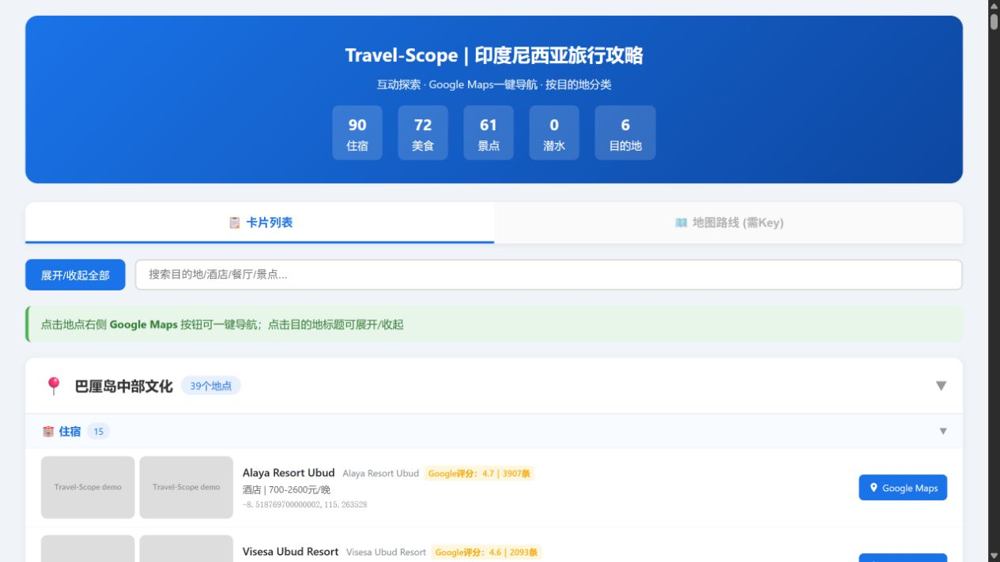
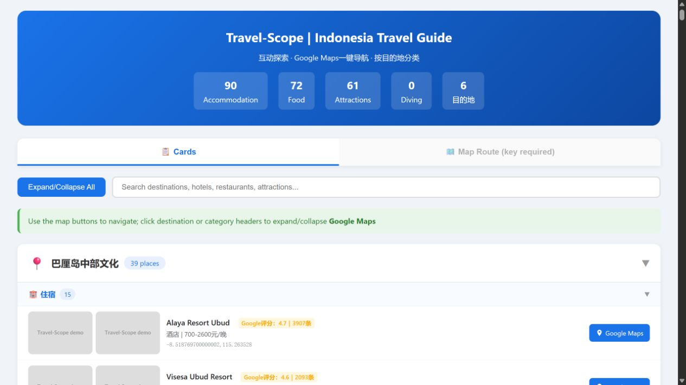
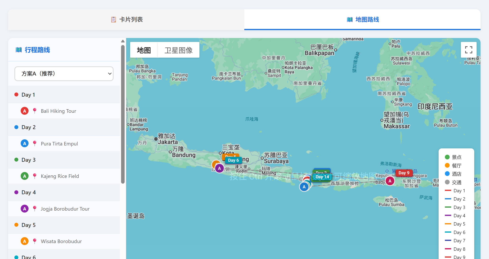

# Travel-Scope

Evidence-aware travel research and itinerary generation for domestic and international travel.

Travel-Scope combines destination discovery, route-corridor exploration, multi-source evidence, structured POI data, and output QA. It generates HTML, Markdown, and Excel from one validated data model, with Chinese and English output.

## Try it without API keys

```powershell
python travel-scope/scripts/gen_travel_scope.py `
  --mode demo `
  --fixture travel-scope/fixtures/demo.json `
  --output-dir .temp/demo `
  --language both
```

The generated files include CN/EN HTML, Markdown, and Excel examples under `examples/demo/`. They use synthetic offline data and are not travel recommendations.

## Live mode

Live mode uses provider credentials supplied at runtime. Do not commit API keys, raw provider responses, image caches, or generated URLs containing keys.

```powershell
python travel-scope/scripts/gen_travel_scope.py `
  --mode live `
  --output-dir <output> `
  --map-platform all `
  --language both
```

See [travel-scope/SKILL.md](travel-scope/SKILL.md) for the SOP and QA gates. See [travel-scope/README.md](travel-scope/README.md) for skill-specific usage.

## Product and workflow previews

- [中文产品介绍](travel-scope-intro.html) / [English product introduction](travel-scope-intro-en.html)
- [中文工作流说明](travel-scope-workflow.html) / [English workflow](travel-scope-workflow-en.html)

The previews include bilingual card screenshots and a route-planning interface example. Public screenshots do not contain provider API keys.

### HTML output preview

Chinese card view:



English card view:



Route planning view:



## Current release

`v2.9.1` — internationalized CN/EN output and offline Demo/Live separation.

## Status

This repository is currently a private release candidate while API, data-source, licensing, and output safety checks are completed.
